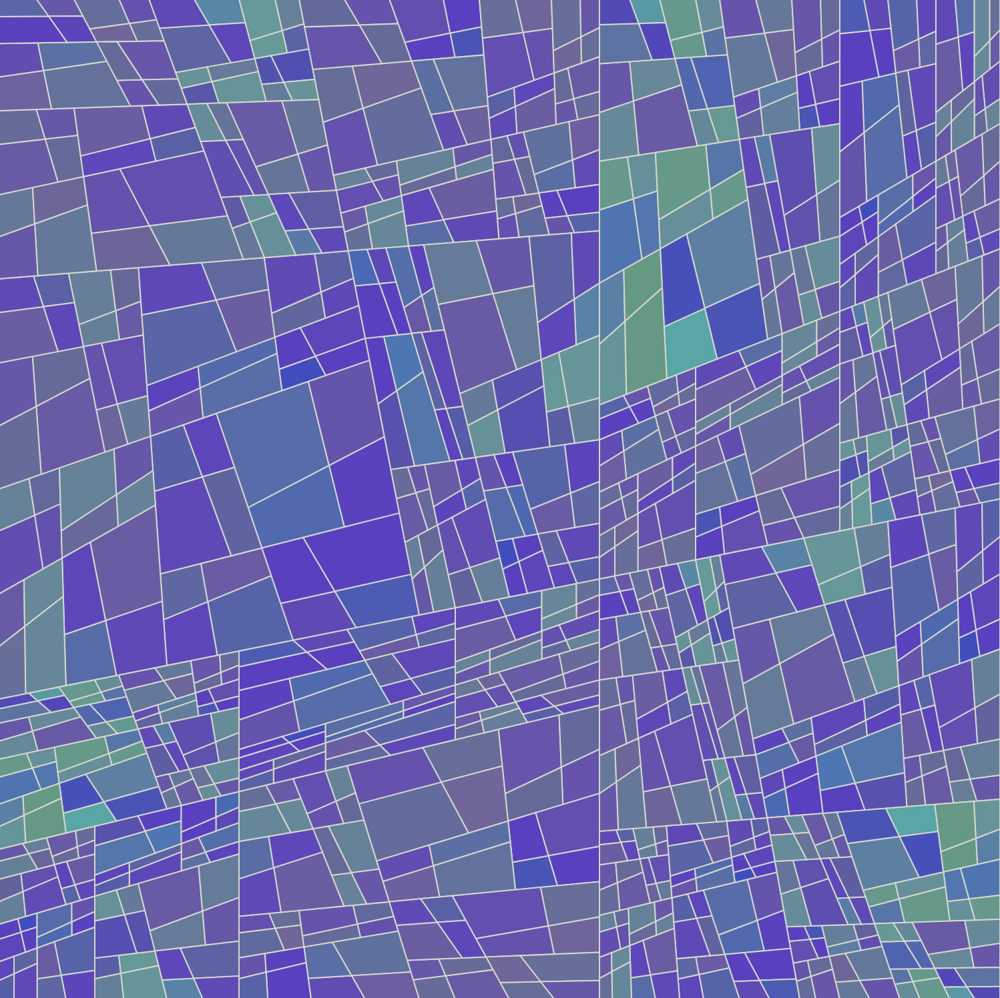

# Quad

Quad is a generative art experiment based on the idea of subdividing quadrilaterals. It is written in Elm.



## Diary

Some years ago I had "composed" some generative art, both static and dynamic, using Processing.  I decided to try my hand at generative art again using Elm, inspired by Xavier Ho's talk at Elm Europe 2018.  First step: search the web.  Among the links I followed was one on [Xavier's home page](https://jumptoglide.com/}), [Generated space](https://generated.space/), in particular [Organic grid](https://generated.space/sketch/organic-grid-2/), which I admired.  Looking at Organic Grid, I could see what the main principles were: (a) start with a square of a certain color, add a random node on each side, then connect nodes on opposite sides to divide the square into four quadrilaterals; repeat this process a certain number of times on each of the subquadrilaterals; (b) as each parent quadrilateral is subdivided, randomly modify the colors of the parent to produce the colors of the children.

### Quad

Most of the work on this project was in writing module `Quad`, and the first step was to make the central type definition:

```
  type Quad = Quad Vertices Color
```
where

```
  type alias Point = ( Float, Float )

  type alias Vertices = Array Point
```

Next was the definition of a `Quad` for test purposes, `basic : Float -> Quad`, a black square of given dimensions, and of accessor functions `vertices : Quad -> Vertices` and `color : Quad -> Color`.  At this point, besides compiling the code, I could run simple tests in `elm repl` like `vertices (Quad.basic 1)`.

The next task was to construct the function

```
  subdivide : Proportions -> Quad -> List Quad
```

This took a good deal of time, including some work with paper and pencil — drawing a subdivision, figuring out how to subdivide in code — and the definition of a fair number of auxiliary functions.  Abit of high-school math was needed to find the "center" of a quadrilateral, defined as the intersection of the two lines which subdivide the rectangle.
Whenever a function body had a `let-in` block, I would put a dummy return value in the `in` clause so that I coud repeatedly compile and check the code under development in the repl.  In this sense, the development process was very much type-driven.  When ready, I tested `subdvide`  by running

```
subdivide ps (basic 4)
```

in the repl, where `Array.fromList [0.5,0.5,0.5,0.5`, then running

```
subdivide ps (basic 4) |> List.map (subdivide ps) |> List.concat
```

The code for evolving the color was easier to write, and once it was done, I defined the function

```
  update : ColorRange
    -> List ColorChange
    -> Proportions
    -> List Quad
    -> List Quad
```

This function is repeatedly applied to `Quad.basic 800` to generate the drawing.  To render it, one uses the function

```
  render : ColorMap -> Quad -> Svg msg
  render colorMap quad =
      TypedSvg.polygon
          [ fill <| Fill (colorMap quad)
          , stroke Color.gray
          , points (Array.toList <| vertices quad)
          ]
          []
```

### Experiment1

Once module `Quad` was finished and tested — most of a day's work — it was time to write a driver to see if things really worked.  Part of the work here was to "tune" program parameters to produce a satisfying result, displayed above as `quad1.png`
